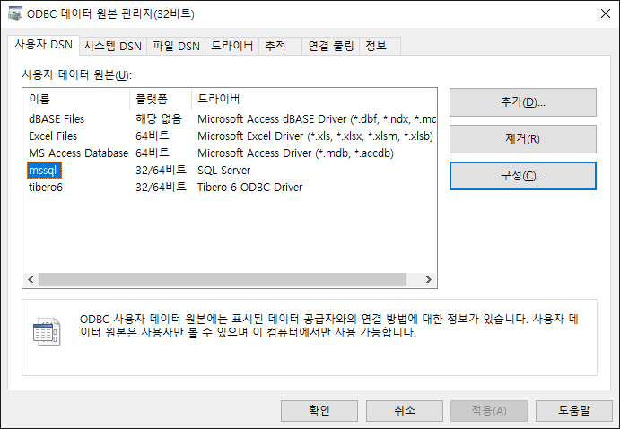
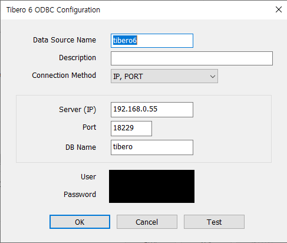
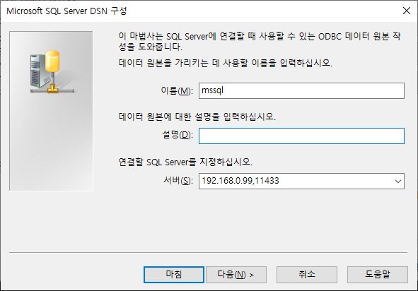
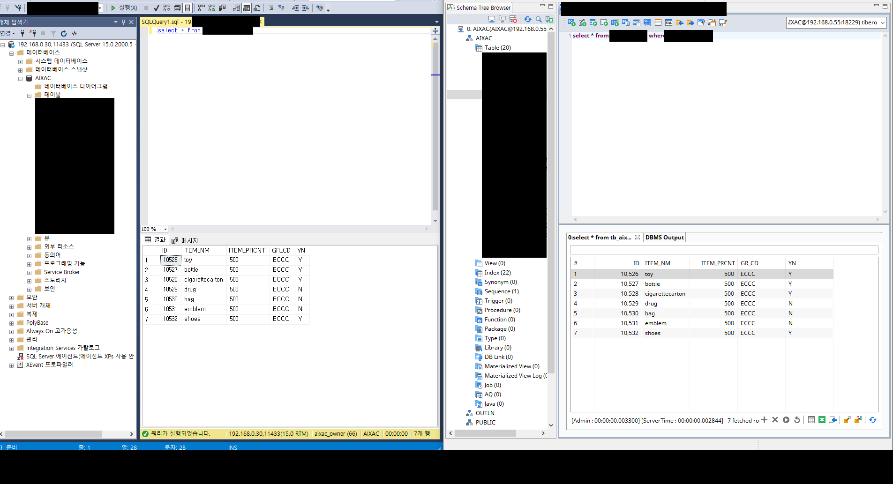

# :computer: Python Batch

## Information

```
sqlArchemy가 지원을 하지 않고, 패쇠망에서 각기 다른 데이터 베이스를 사용하기 위해 직접 쿼리를 짤 때 사용
```

## Tech/Framework Used

- Python 3.7.4
- pyodbc 4.0.30
- schedule 0.6.0

**built with**

- VSCODE

## Setting

1. _VSCODE_ 에서 `AIXAC_MSSQLtoTIBERO` 프로젝트 폴더 열고 `Terminal - New Terminal` 메뉴로 터미널 접속

   - `D:\AIXAC_MSSQLtoTIBERO Project` 프로젝트 폴더 생성 후 진행

2. python 가상환경 생성

   - 생성 경로는 AIDM 프로젝트 폴더 내에 생성

   - `python -m venv {venv_name}`

3. python 가상환경 실행

   - `{venv_name}\Scripts\activate`

4. python 라이브러리 설치

   - `pip install pyodbc`
   - `pip install schedule`

5. Make ".\*exe"

```
pyinstaller --noconfirm --clean ^
--distpath . ^
--onedir ^
-n AIXAC_MSSQLtoTIBERO_v0.1.0 ^
--noconsole ^
--win-private-assemblies ^
--paths ./venv/Lib/site-packages ^
--icon=logo.ico ^
--key 1234567890abcdef ^
run.py
```

## Requirement

- pyodbc==4.0.30
- schedule==0.6.0

## Document

1. server의 odbc를 적용

   - ODBC 창

     

   - TIBERO

     

   - MSSQL

     

2. Terminal에서 venv\Scripts\activate 실행

3. python test.py를 통해 test.py의 실행 확인

   - Test Result

     

4. python run.py 실행


## Made

© [mizzleaa](https://github.com/mizzleaa)
